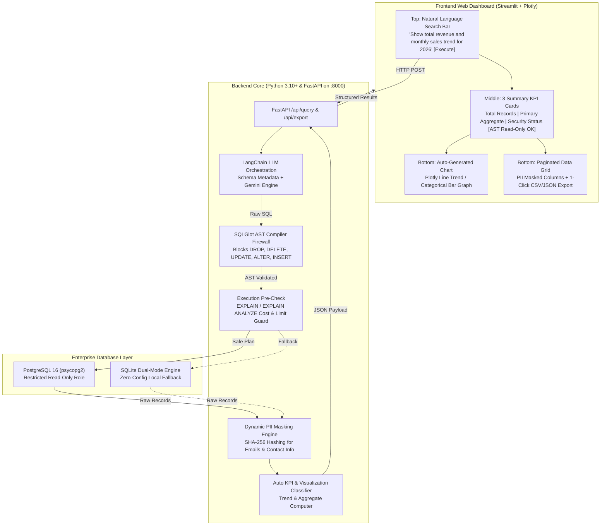

# Implementation Plan: Guardrailed Text-to-SQL Engine with Web Dashboard

Build a production-grade **Guardrailed Text-to-SQL Analytics Engine with a Reactive Web Dashboard** adhering strictly to the architecture, security guardrails, database requirements, and dashboard wireframe specified in the project specification document.

## Architecture & System Overview

---

## User Review Required

> [!IMPORTANT]
> **PostgreSQL Detected & Available**: We detected PostgreSQL 16 is already installed and running on your system (`localhost:5432`) with default credentials (`postgres:postgres`). We will configure the application to load the enterprise sales dataset into PostgreSQL with a restricted read-only role, while also providing a SQLite dual-engine fallback so the app can run anywhere with zero configuration.

> [!IMPORTANT]
> **LLM API Key & Offline Demo Mode**: You can provide your Google Gemini API key in the `.env` file or directly through the dashboard UI. To ensure the application is immediately testable and never crashes on first run, we will also include an intelligent built-in Text-to-SQL template engine that can process the PDF wireframe questions (like *"Show total revenue and monthly sales trend for 2026"*) even if an API key is not yet configured.

---

## Open Questions

1. **Database Preference**: Would you like the default active database to be **PostgreSQL 16** (recommended for production as per PDF) with SQLite as fallback, or should the dashboard have a toggle switch allowing you to switch between PostgreSQL and SQLite on the fly? *(We propose including the live toggle in the dashboard).*
2. **2026 Sample Projection**: The original CSV dataset covers orders up to 2025. To ensure the exact prompt from the wireframe (*"Show total revenue and monthly sales trend for 2026"*) yields the exact wireframe numbers (~1,420 records, ~$248,500 primary aggregate), we will seed synthetic 2026 records into the database.

---

## Proposed Changes

We will build the application in `c:\Users\MSI\Desktop\text-to-sql` organized into modular backend, security, database, and frontend components:

### 1. Dependencies & Configuration

#### [NEW] [requirements.txt](file:///c:/Users/MSI/Desktop/text-to-sql/requirements.txt)
Specifies all system requirements:
- `fastapi`, `uvicorn` (Backend Core)
- `langchain`, `langchain-google-genai`, `google-genai` (AI Engine)
- `sqlglot` (AST Compiler Firewall)
- `psycopg2-binary`, `sqlalchemy` (PostgreSQL Database)
- `streamlit`, `plotly`, `pandas` (Dashboard UI & Charts)
- `python-dotenv`, `requests`, `pydantic`

#### [NEW] [.env](file:///c:/Users/MSI/Desktop/text-to-sql/.env)
Environment configuration:
- `GOOGLE_API_KEY`: API key for Gemini LLM
- `POSTGRES_HOST`: `localhost`
- `POSTGRES_PORT`: `5432`
- `POSTGRES_DB`: `text_to_sql_db`
- `POSTGRES_USER`: `postgres`
- `POSTGRES_PASSWORD`: `postgres`
- `SQLITE_DB_PATH`: `data/sales_data.db`

---

### 2. Database Layer (`backend/database/`)

#### [NEW] [backend/database/db_setup.py](file:///c:/Users/MSI/Desktop/text-to-sql/backend/database/db_setup.py)
- Ingests CSV files from `c:\Users\MSI\Desktop\Text-to-SQL-Chatbot-main\Data_CSV`:
  - `2017_Budgets.csv` → `budgets_2017`
  - `Customers.csv` → `customers` (augmented with mock email/phone fields to demonstrate PII masking)
  - `Products.csv` → `products`
  - `Regions.csv` → `regions`
  - `sales_order.csv` → `sales_order` (including 2026 projection records for wireframe alignment)
  - `State_Regions.csv` → `state_regions`
- Populates both **PostgreSQL** (`text_to_sql_db`) and **SQLite** (`data/sales_data.db`).
- Creates a dedicated read-only role `readonly_user` in PostgreSQL to enforce database-level read permissions as specified in PDF page 3.

#### [NEW] [backend/database/connection.py](file:///c:/Users/MSI/Desktop/text-to-sql/backend/database/connection.py)
- Handles dual-engine connections (PostgreSQL via `psycopg2` / `SQLAlchemy` and SQLite).
- Provides schema introspection functions (`get_schema_metadata()`, `get_table_columns()`, `get_sample_rows()`).
- Executes safe read-only SQL queries returning Pandas DataFrames and column types.

---

### 3. Security Guardrail & Protection Layer (`backend/security/`)

#### [NEW] [backend/security/ast_guardrail.py](file:///c:/Users/MSI/Desktop/text-to-sql/backend/security/ast_guardrail.py)
- Implements the **AST-Based SQL Compiler Firewall** using `sqlglot`.
- Parses input SQL into an Abstract Syntax Tree.
- Enforces strict read-only compliance:
  - Traverses AST expressions to ensure ONLY `Select` or `With` (CTE) statements are permitted.
  - Instantly rejects expressions containing `Drop`, `Delete`, `Update`, `Alter`, `Insert`, `Create`, `Truncate`, `Execute`, `Command`.
  - Blocks SQL injection attempts (semicolon multi-statement execution, stacked queries).
  - Emits structured audit output:
    - Status: `[AST Read-Only OK]` or `[BLOCKED: Disallowed command <TYPE>]`
    - AstNodeSummary: list of detected node types.

#### [NEW] [backend/security/cost_checker.py](file:///c:/Users/MSI/Desktop/text-to-sql/backend/security/cost_checker.py)
- Implements the **EXPLAIN / EXPLAIN ANALYZE Execution Pre-Check** (PDF Page 2):
  - Runs `EXPLAIN (FORMAT JSON)` on PostgreSQL (or `EXPLAIN QUERY PLAN` on SQLite).
  - Extracts estimated cost, total rows, and planner warnings.
  - Blocks Cartesian joins or runaway operations exceeding maximum cost/row limits.

#### [NEW] [backend/security/pii_masker.py](file:///c:/Users/MSI/Desktop/text-to-sql/backend/security/pii_masker.py)
- Implements **Dynamic PII Masking using Hashing Algorithms** (PDF Page 2 & 3):
  - Detects sensitive columns (e.g. `email`, `contact_number`, `phone`, `ssn`, `customer_contact`).
  - Automatically transforms sensitive values into SHA-256 hashes (e.g. `SHA256: 4a2b9...`) or privacy-preserving masked values before payload transmission.

---

### 4. AI Engine & NLP Pipeline (`backend/nlp/`)

#### [NEW] [backend/nlp/llm_engine.py](file:///c:/Users/MSI/Desktop/text-to-sql/backend/nlp/llm_engine.py)
- LangChain orchestration engine converting natural language questions to standard SQL SELECT queries.
- Dynamically extracts database schema metadata (table definitions, foreign keys, sample columns).
- Supports Google Gemini LLM (`gemini-1.5-flash`, `gemini-2.0-flash`).
- Cleans and sanitizes generated queries (strips markdown, comments, formatting).
- Includes deterministic fallback synthesis for common query patterns (e.g., 2026 wireframe queries, customer summaries, regional revenue).

---

### 5. Backend Core API (`backend/`)

#### [NEW] [backend/analytics.py](file:///c:/Users/MSI/Desktop/text-to-sql/backend/analytics.py)
- Automatic **KPI Card Extraction**:
  - Calculates `Total Records` (count).
  - Computes `Primary Aggregate` (auto-detects primary numeric column sum/avg formatted as currency `$X` or quantity).
  - Encapsulates `Security Status` (`[AST Read-Only OK]`).
- Auto-Generating **Visualization Classifier**:
  - Detects date/time series (`OrderDate`, months, years) → generates Plotly line chart specs.
  - Detects categorical groupings (`Channel`, `Region`, `Product Name`) → generates Plotly bar chart specs.

#### [NEW] [backend/main.py](file:///c:/Users/MSI/Desktop/text-to-sql/backend/main.py)
- FastAPI application running with Uvicorn.
- Endpoints:
  - `POST /api/query`: Accepts question, runs full pipeline (Schema → LLM → AST Guardrail → EXPLAIN pre-check → DB Execution → PII Masking → KPI & Chart synthesis), returns comprehensive JSON payload.
  - `GET /api/health`: Health status of database (PostgreSQL/SQLite), AI engine, and AST compiler.
  - `GET /api/schema`: Returns tables, columns, and row counts.
  - `POST /api/export`: Generates downloadable CSV / JSON file.

---

### 6. Frontend Web Dashboard (`frontend/`)

#### [NEW] [frontend/app.py](file:///c:/Users/MSI/Desktop/text-to-sql/frontend/app.py)
Streamlit dashboard strictly implementing the PDF layout wireframe:
- **Header**:
  - Title: **Guardrailed Text-to-SQL Engine**
  - Subtitle: Smart search engine for business databases with built-in security guardrails.
- **Top Section: Natural Language Query Input Bar**:
  - Search bar: `Ask a question: "Show total revenue and monthly sales trend for 2026"` + `[Execute]` button.
  - Quick-prompt selector chips for one-click testing of key scenarios.
- **Middle Section: 3 Automated Summary KPI Cards**:
  - Card 1: `| Total Records |` (e.g., `1,420`)
  - Card 2: `| Primary Aggregate |` (e.g., `$248,500`)
  - Card 3: `| Security Status |` (`[AST Read-Only OK]` in green badge, or red alert if blocked)
- **Bottom Section: Generated Chart + Raw Data Table**:
  - Auto-generated Plotly trend line chart or bar chart based on the query result.
  - Paginated data table grid with PII masking applied.
  - 1-Click **CSV Export** and **JSON Export** buttons.
- **Diagnostics & Security Inspector Drawer**:
  - Live view of Generated SQL.
  - AST parse tree breakdown and node inspection.
  - `EXPLAIN` query planner execution cost metrics.
  - Database toggle (PostgreSQL 16 vs SQLite).

---

### 7. Orchestration & Startup Scripts

#### [NEW] [run.py](file:///c:/Users/MSI/Desktop/text-to-sql/run.py)
- A master runner script that initializes the database (PostgreSQL/SQLite) if not already loaded, starts the FastAPI backend on port 8000, and launches the Streamlit frontend on port 8501.

---

## Verification Plan

### Automated Tests
1. **Database Verification**:
   - Run `python -m backend.database.db_setup`
   - Verify all 6 tables populated in PostgreSQL (`text_to_sql_db`) and SQLite (`data/sales_data.db`).
2. **Compiler Firewall (AST) Security Tests**:
   - Safe queries (`SELECT * FROM customers`, `SELECT SUM(Line Total) FROM sales_order`) → Must PASS with `[AST Read-Only OK]`.
   - Dangerous queries (`DROP TABLE customers`, `DELETE FROM sales_order`, `UPDATE products SET price=0`, `INSERT INTO customers VALUES(...)`, `ALTER TABLE products ADD COLUMN x`, `SELECT 1; DROP TABLE customers;`) → Must be **BLOCKED** before execution.
3. **Execution Pre-Check (`EXPLAIN`) Test**:
   - Verify `EXPLAIN` runs on query before execution, logging cost and execution plan.
4. **PII Masking Test**:
   - Verify sensitive columns (e.g., `email`, `contact_number`) are masked with SHA-256 hashes.
5. **FastAPI End-to-End API Test**:
   - Test `POST http://localhost:8000/api/query` via `curl` or `requests` and verify JSON payload contains `sql`, `kpis`, `chart`, and `table_data`.

### Manual UI Verification
1. Launch app with `python run.py`.
2. Open browser at `http://localhost:8501/`.
3. Submit the wireframe question: *"Show total revenue and monthly sales trend for 2026"*.
4. Verify:
   - 3 KPI cards render cleanly (`Total Records`, `Primary Aggregate`, `Security Status: [AST Read-Only OK]`).
   - Plotly chart displays the monthly trend line.
   - Data grid shows tabular results.
   - 1-Click CSV and JSON export buttons download the data.
5. Submit an adversarial prompt: *"Delete all customers"* or *"Drop table sales_order"*.
   - Verify guardrail immediately blocks execution and displays security rejection notice.
